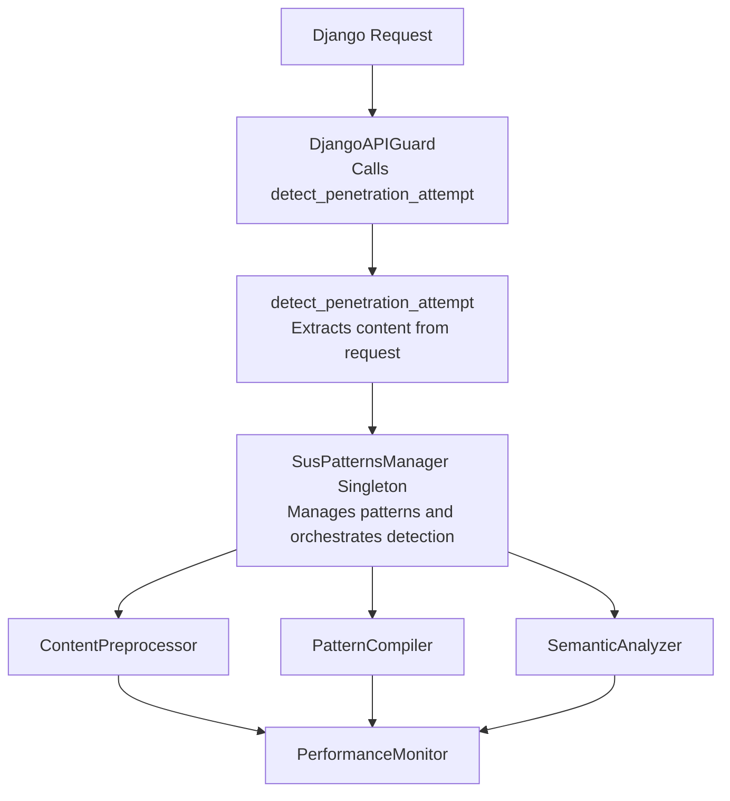

# Detection Engine Architecture

The DjangoAPI Guard Detection Engine uses a modular architecture that provides timeout-protected pattern matching with optional preprocessing and heuristic analysis.

## System Architecture



## Core Components

### 1. SusPatternsManager
Central component managing detection process with singleton pattern, pattern loading, and component orchestration.

### 2. Component Initialization
Components are initialized lazily based on configuration - PatternCompiler, ContentPreprocessor, SemanticAnalyzer, and PerformanceMonitor.

## Detection Flow

1. **Request Reception**: Middleware checks if penetration detection is enabled
2. **Content Extraction**: Query parameters, request body, path parameters, headers
3. **Detection Process**: Preprocessing, pattern matching with timeout, semantic analysis
4. **Results**: Comprehensive threat information returned

## Detection Result Structure

```python
{
    "is_threat": bool,
    "threat_score": float,          # 0.0-1.0
    "threats": [{"type": "regex", "pattern": str, ...}],
    "context": str,
    "execution_time": float,
    "detection_method": str,        # "enhanced" or "legacy"
    "timeouts": list[str],
    "correlation_id": str | None
}
```

## Next Steps

- Review [Components](components.md)
- See [Configuration Guide](configuration.md)
- Check [Performance Tuning](performance-tuning.md)
